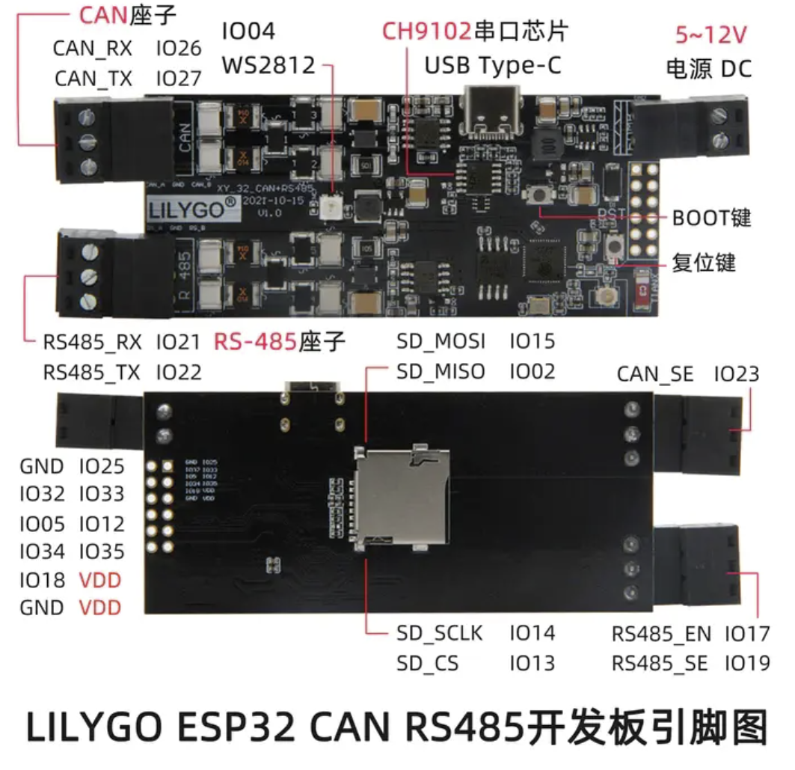

# Growatt MOD 5000TL3-X ESPHome Modbus Integration

A complete, tested ESPHome configuration for monitoring **Growatt MOD 5000TL3-X** solar inverters via RS485 Modbus RTU protocol, integrated with Home Assistant and/or MQTT for real-time solar energy monitoring. The setup additionally allows the user to limit the inverter power output (wattage), or turn the inverter on and off altogether. 

## Table of Contents

1. [Architecture Overview](#1-architecture-overview)
2. [Hardware Components and Wiring](#2-hardware-components-and-wiring)
3. [ESP32 Configuration with ESPHome](#3-esp32-configuration-with-esphome)
4. [Modbus Registers Explanation](#4-modbus-registers-explanation)


---

## 1. Architecture Overview

### System Architecture

This project creates a complete solar monitoring and control solution using a modern, local-first approach:

```
Solar Panels → Growatt MOD 5000TL3-X Inverter → RS485/Modbus RTU → LilyGO T-CAN485 ESP32 → WiFi → Home Assistant / MQTT
```

### Component Roles

**Home Assistant**
- Central monitoring and automation platform
- Real-time dashboards and energy analytics
- Historical data storage and visualization
- Automation triggers based on solar production

**ESPHome**
- ESP32 Firmware platform providing seamless Home Assistant integration
- Automatic device discovery and configuration
- Over-the-air (OTA) updates
- Native Home Assistant API integration

**LilyGO T-CAN485 ESP32 Board**
- ESP32 microcontroller with built-in RS485 transceiver, no soldering or wiring required.
- Eliminates need for external RS485 converter circuits
- WiFi connectivity for Home Assistant communication
- GPIO pins pre-configured for RS485 communication

**Modbus RTU Protocol**
- Industrial-standard communication protocol
- Reliable data transmission over RS485
- Supports multiple data types (16-bit, 32-bit integers)
- Error detection and correction

**Growatt MOD 5000TL3-X Inverter**
- Solar inverter with built-in SYS COM port
- Modbus RTU slave device (default address: 1)
- Provides real-time solar production data
- System status and diagnostic information

### Data Flow

1. **Solar Production**: Inverter converts DC from panels to AC for grid
2. **Data Collection**: Inverter continuously updates internal registers
3. **Modbus Communication**: ESP32 polls inverter every 30 seconds via RS485
4. **Data Processing**: ESPHome processes raw Modbus data and applies scaling
5. **Home Assistant Integration**: Processed data sent via WiFi to Home Assistant
6. **Visualization**: Real-time dashboards, historical charts, and automation triggers

### Benefits

- **Local Control**: No cloud dependency, works offline
- **Real-time Monitoring**: 30-second update intervals, or less
- **Professional Integration**: Native Home Assistant device discovery
- **Expandable**: Easy to add multiple inverters or additional sensors
- **Reliable**: Industrial Modbus protocol ensures data integrity

---

## 2. Hardware Components and Wiring

### Why LilyGO T-CAN485 Makes This Simple

The LilyGO T-CAN485 board is specifically designed for industrial communication applications, making this project straightforward:

**Built-in RS485 Transceiver**
- No external RS485 converter needed
- No complex wiring diagrams
- No additional components to purchase
- Professional-grade signal conditioning

**Integrated Design**
- ESP32 microcontroller with WiFi
- RS485 transceiver on-board
- Power management included
- Compact form factor

**Pre-configured LiliGo GPIO Mapping**
- GPIO21: RS485 RX (connects to RS485-B)
- GPIO22: RS485 TX (connects to RS485-A)
- GPIO16: 5V rail enable for RS485 chip
- GPIO17: Auto-direction control
- GPIO19: RS485 chip enable

### Required Components

| Component | Description | Where I got it |
|-----------|-------------|---------|
| **LilyGO T-CAN485** | ESP32 Development Board with RS485 | [TinyTronics SKU: 005278](https://www.tinytronics.nl) - €16,50 |
| **External antenna** | Antenna for ESP32 development board | [TinyTronics SKU: 001098](https://www.tinytronics.nl) - €2,00 |
| **Growatt 16-pin COM Connector** | SYS COM port connector | [Stralend Groen](https://stralendgroen.nl) |
| **2-Wire Cable** | RS485 communication cable | Any electronics supplier. |
| **USB-C Power Supply** | For LiliGo board | [TinyTronics SKU: 002192](https://www.tinytronics.nl) - €9,00 |
| **IP65 Enclosure** | Weatherproof housing | [TinyTronics SKU: 001800](https://www.tinytronics.nl) - €8,00 |

### Cable Assembly Instructions

#### SYS COM Port Pinout


**Important**: Always refer to the official [Growatt MOD Inverter Documentation](growatt-mod-inverter-docs.pdf) for complete SYS COM port specifications.

#### Pin Connections

Based on the Growatt MOD series documentation, the 16-pin SYS COM connector uses the following pins for RS485 communication:

| Growatt SYS COM Pin | Function | LilyGO T-CAN485 Pin | 
|---------------------|----------|---------------------|
| **Pin 3** | RS485-A | GPIO22 (TX) | 
| **Pin 4** | RS485-B | GPIO21 (RX) | 

#### Wiring Steps

1. **Prepare the data wire**
   - Strip 5mm of insulation from 2-wire cable on both ends

2. **Connect wires to Growatt SYS COM Port and LiliGo terminals**
   - **Pin 3 (RS485-A)** → GPIO22 RS485 terminal on LiliGo
   - **Pin 4 (RS485-B)** → GPIO21 RS485 terminal on LiliGo 
   - 
   - 


## 3. ESP32 Configuration with ESPHome

### ESPHome Web Interface Setup

Instead of using command-line tools, we'll use the ESPHome web interface for a user-friendly configuration experience.

1. Open ESPHome dashboard
2. Click **+ NEW DEVICE**
3. Enter device name: `growatt-tcan485`
4. Select **ESP32** as device type
5. Choose **ESP32 Dev Module** board

#### Step 3: Configuration File

Use the provided [`growatt-liligo-tcan485.yaml`](growatt-liligo-tcan485.yaml) configuration file. Here are the key sections explained:

#### Step 4: Upload Firmware via Web Interface

1. **Prepare secrets.yaml**
   ```yaml
   wifi_ssid: "Your_WiFi_Network"
   wifi_password: "Your_WiFi_Password"
   ```

2. **Compile Firmware**
   - Click **INSTALL** in ESPHome dashboard
   - Select **Manual download**
   - Wait for compilation to complete

3. **Initial Upload via USB**
   - Connect ESP32 to computer via USB-C
   - Click **Plug into this computer**
   - Select the compiled firmware file
   - Upload to device

4. **Subsequent Updates (OTA)**
   - After initial setup, updates can be done wirelessly
   - ESPHome will update over WiFi

#### Step 5: Verify Connection

1. **Check ESPHome Logs**
   - Click **LOGS** in ESPHome dashboard
   - Verify WiFi connection
   - Check Modbus communication


### Troubleshooting Common Issues

**No Modbus Communication**
- Verify RS485 wiring (A and B may be swapped)
- Check inverter is powered and operational

**WiFi Connection Issues**
- Check secrets.yaml file
- Verify WiFi credentials
- Use fallback hotspot if needed

**Compilation Errors**
- Ensure ESPHome is up to date
- Check YAML syntax
- Verify all required libraries are available

---

## 4. Modbus Registers Explanation

### Understanding Modbus Register Types

The Growatt inverter uses two types of Modbus registers:

**Holding Registers (Function Code 3)**
- Read/write registers for configuration
- Used for inverter settings and control
- Examples: On/Off control, power limits

**Input Registers (Function Code 4)**  
- Read-only registers for measurements
- Real-time sensor data and status
- Examples: Power output, energy totals, voltages

### 32-bit Integer Handling

Many important values (power, energy) are stored as 32-bit integers across two consecutive 16-bit registers:

**Why `register_count: 2` is Required**
```yaml
- platform: modbus_controller
  name: "Growatt AC Output Power"
  address: 35           # Start address (Pac H)
  register_count: 2     # Read 2 registers (35 + 36)
  value_type: U_DWORD   # Unsigned 32-bit integer
  filters:
    - multiply: 0.1     # Convert to watts
```

**Register Layout for 32-bit Values**
- **High Register**: Contains upper 16 bits
- **Low Register**: Contains lower 16 bits  
- **Combined**: Forms complete 32-bit value

### Key Register Mappings

Based on the [`growatt-liligo-tcan485.yaml`](growatt-liligo-tcan485.yaml) configuration and [Growatt Modbus Documentation](growatt-modbus-docs.pdf):

#### Power Measurements
| YAML Address | Modbus Register | Description | Data Type | Scaling | Unit |
|--------------|-----------------|-------------|-----------|---------|------|
| 35-36 | Pac H/L | AC Output Power | U_DWORD | ×0.1 | W |
| 5-6 | Ppv1 H/L | PV1 Input Power | U_DWORD | ×0.1 | W |
| 9-10 | Ppv2 H/L | PV2 Input Power | U_DWORD | ×0.1 | W |

#### Energy Totals
| YAML Address | Modbus Register | Description | Data Type | Scaling | Unit |
|--------------|-----------------|-------------|-----------|---------|------|
| 53-54 | EAC today H/L | Daily Energy Production | U_DWORD | ×0.1 | kWh |
| 55-56 | EAC total H/L | Total Energy Production | U_DWORD | ×0.1 | kWh |

#### Voltage and Current
| YAML Address | Modbus Register | Description | Data Type | Scaling | Unit |
|--------------|-----------------|-------------|-----------|---------|------|
| 3 | Vpv1 | PV1 Voltage | U_WORD | ×0.1 | V |
| 7 | Vpv2 | PV2 Voltage | U_WORD | ×0.1 | V |
| 4 | PV1Curr | PV1 Current | U_WORD | ×0.1 | A |
| 8 | PV2Curr | PV2 Current | U_WORD | ×0.1 | A |
| 38 | Vac1 | Grid Voltage | U_WORD | ×0.1 | V |
| 37 | Fac | Grid Frequency | U_WORD | ×0.01 | Hz |

#### Status and Diagnostics
| YAML Address | Modbus Register | Description | Data Type | Values |
|--------------|-----------------|-------------|-----------|---------|
| 0 | Inverter Status | Operating State | U_WORD | 0=Waiting, 1=Normal, 3=Fault |
| 93 | Temp1 | Inverter Temperature | U_WORD | ×0.1 °C |
| 105 | Fault Code | Error Code | U_WORD | See fault code table |

#### Control Registers (Holding)
| YAML Address | Modbus Register | Description | Data Type | Range |
|--------------|-----------------|-------------|-----------|-------|
| 0 | OnOff | Remote On/Off | U_WORD | 0=Off, 1=On |
| 3 | Active P Rate | Power Limit | U_WORD | 0-100% |

### Data Scaling Examples

**Power Reading Example**
```yaml
# Raw Modbus value: 25000 (from registers 35-36)
# Scaled value: 25000 × 0.1 = 2500.0 W
filters:
  - multiply: 0.1
```

**Energy Reading Example**  
```yaml
# Raw Modbus value: 1234 (from registers 53-54)
# Scaled value: 1234 × 0.1 = 123.4 kWh
filters:
  - multiply: 0.1
```

**Frequency Reading Example**
```yaml
# Raw Modbus value: 5000 (from register 37)
# Scaled value: 5000 × 0.01 = 50.00 Hz
filters:
  - multiply: 0.01
```

### Register Documentation Cross-Reference

This configuration has been verified against:
- **[growatt-modbus-docs.pdf](growatt-modbus-docs.pdf)**: Complete Modbus register specification
- **[growatt-mod-inverter-docs.pdf](growatt-mod-inverter-docs.pdf)**: MOD series hardware documentation
- **Actual MOD 5000TL3-X inverter**: Field-tested and verified

### Home Assistant Integration

Once configured, the following entities will automatically appear in Home Assistant:


---

## 🚨 Safety and Installation Notes

**⚠️ WARNING: High Voltage Present**
- Always disconnect AC and DC power before wiring
- Use insulated tools and follow electrical safety procedures

**Installation Requirements**
- Must be installed by qualified electrical personnel
- Comply with local electrical codes and regulations
- Obtain necessary permits and utility approvals

**System Compatibility**
- ✅ Tested with Growatt MOD 5000TL3-X

---

## 📚 Documentation References

- [ESPHome Modbus Controller Documentation](https://esphome.io/components/modbus_controller.html)
- [Growatt Modbus Protocol Specification](growatt-modbus-docs.pdf)
- [Growatt MOD Inverter Installation Manual](growatt-mod-inverter-docs.pdf)
- [LilyGO T-CAN485 Hardware Documentation](https://github.com/Xinyuan-LilyGO/T-CAN485)

---

**Status:** ✅ Fully tested and operational with Growatt MOD 5000TL3-X  
